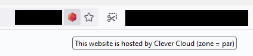
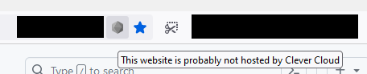

# Clever Cloud Detector

A web extension to detect if websites you browse are hosted by [Clever Cloud](https://www.clever-cloud.com).

## What is the point?

I wanted to learn making a Web Extension and as a proud user of [Clever Cloud](https://www.clever-cloud.com) I though this would be fun to randomly discover other Clever Cloud users while browsing.

## How does it looks like?

It adds an icon inside the browser's address bar.
If you visit a website hosted by Clever Cloud, the icon is colored.

## How does it works?

A script activates every time you navigate to a new page.
It extracts the page's hostname and checks if it is hosted by Clever Cloud using the following heuristics:

- hostname has a domain name that is publicly known to be owned by Clever Cloud (for example: \*.clever-cloud.com)
- hostname is a CNAME to one of Clever Cloud's frontal domains (for example: domain.par.clever-cloud.com) or to one of its owned domains
- hostname is a A to one of Clever Cloud's frontal domains (a public endpoint on Clever Cloud's API is used to get the whole list of their zones, then the extension gets the corresponding IPs of every zone using DNS resolution)

_Note: IPs of Clever Cloud's frontal web server are cached in session storage to avoid getting them too often, as they are not supposed to change by the hour._

## How to get it?

Extension is not yet published, so you will need to build it locally and [install it as a temporary extension](https://extensionworkshop.com/documentation/develop/temporary-installation-in-firefox/).

## How to build it?

This requires a ~recent installation of [Node.js](https://nodejs.org).

- install dependencies: `npm install`
- build extension: `npm run package`
- extension can then be found in the `web-ext-artifacts` directory

## License

MIT License Copyright (c) 2023 David Sferruzza
